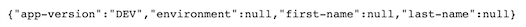

# Part 0: quick refresher on how to use Docker

## Objectives

- get familiar with basic docker command
- understand containers and images

## A. The beginning

Before making the big jump in Kubernetes, let's have a look on how to create our workflow using plain Docker. We'll create a simplified version of it just to get a basic understanding of how docker works.

### a. The dummy api

First, let's have a look at the code of our dummy-api :

```python
# code/dummy_api/api/main.py

from flask import Flask, jsonify
from redis import Redis
import os

app = Flask(__name__)
redis = Redis(
    host="redis-service",  # Host to find the redis-server. Here, the host is a container name and not an IP address!
    port=4321,  # Port to find the redis-server
    decode_responses=True  # Boolean to avoid dealing with bytes instead of strings
)

@app.route("/")
def describe_redis():

    app_version = os.getenv("VERSION")

    try:
        first_name = redis.get("first-name")
        last_name = redis.get("last-name")
        environment = redis.get("environment")
    except:
        first_name = "ERROR"
        last_name = "ERROR"
        environment = "ERROR"
    
    return jsonify({
        "app-version": app_version,
        "first-name": first_name,
        "last-name": last_name,
        "environment": environment
    })
```


As explained in the introduction, this dummy-api reads values from a redis server, hosted on "redis-service" and using the port 4321. The api retrieves values from this server (the first-name, last-name and environment) and print it along with the "VERSION" environment variable. Simple enough !

Let’s try to make a containerized version of this api using Docker. Before creating a container that runs our code, we need to build an image for this container. An image is a snapshot of what you would like to containerized. To make some analogy with object oriented programming, an image is a class and a container is an instance. In our case, our image will contain the api code, the python version to run it and the necessary libraries (Flask, gunicorn and a redis client). To create this image (the correct terminology is to build this image), we’ll use a Dockerfile. It will describe how to create the snapshot. Here is our Dockerfile from our dummy-api :

```Dockerfile
# code/dummy_api/Dockerfile

FROM python:3.8

COPY ./requirements.txt /requirements.txt
RUN pip install -r requirements.txt

COPY . /app
WORKDIR /app

# Default app version. If not specified in the build, it will be version 1.0
ARG app_version=1.0
ENV VERSION=$app_version

# Expose port 3894 (important for the Kube example !)
CMD ["gunicorn", "--bind", "0.0.0.0:3894", "api.main:app"]
```

Let’s describe a bit what’s going on here, starting with the FROM instruction. Very often, you’ll build an image using some already built images. In our case, we’ll use a python 3.8 image as our base image. We then copy some files in the container (requirements.txt and the content of our folder, containing our app)  and make the required pip install commands to get our libraries. To be able to change some variables at build time, we can specify some build args. Here the build arg is our app_version that we can set without changing the code. We’ve put a default value of 1.0 that can be override by the docker build command (see below). Finally, we specify a CMD command. The CMD instruction will be run by the container when starting. In our case, it will run our code (api.main:app) using gunicorn, a popular WSGI (see reference below for more information), on port 3894.

Let’s build our image !

```bash
docker build . --build-arg app_version=DEV -t dummy-api:dev
```

Here, we pass an app_version equals to DEV and we also tag our image with the value "dev" when doing "-t dummy-api:dev".

After the build, we can check that our newly built image exists :

```bash
docker image ls
```


Now that our image is created, we can create and run a container based on this image (an instance of this image if you remember the analogy of object oriented programming) :

```bash
docker run --name my-dummy-api -p 8083:3894 -d --rm dummy-api:dev
```

Let’s describe our docker run command :

- the --name flag is used to attach a name to our container. This name can then be use to apply some docker command to it (for example stop the container or remove the container).
- the -p flag describes the port mapping. As the docker documentation puts it : “By default, when you create a container, it does not publish any of its ports to the outside world”. So if we want to access our dummy_api using our favorite browser, we need to expose at least one of its port. This is where the -p flag comes in handy. Here, we want the port 3894 in the container to be accessible by the port 8083 of the machine on which it is run (the Docker host, localhost in our case). Using this flag with those values, we basically say that we want to access our api when browsing to http://localhost:8083. 
- the -d flag specify that we want to run the container in detached mode. If not specified, you would get the return logs of the gunicorn code and wouldn't get your terminal back after the container is up (you can try if you want).
- finally, the --rm is used to automatically remove our container when we stop it. It’s helpful when you use named container and want to easily reuse container names.

We can see our newly built container by running the following command :

```bash
docker ps
```


And by accessing http://localhost:8083, we can see our app !


The good news is that it worked ! The bad news is that it won't access our redis server because we still need to create it... Let's do that !

### b. The redis server

For the redis server, we'll use an pre-built image : the redis:alpine3.10. This means that we'll create a container based on a image already built on [Dockerhub](https://hub.docker.com/_/redis) (a repository for docker image). So we won’t need the docker build step and well jump straight to the docker run command :

```bash
docker run --name redis-service -d --rm redis:alpine3.10 redis-server --port 4321
```

Let's describe what's happening here :

- we ask docker to run a container named "redis-service" with the detached mode ("-d") and to remove it when stopped (“--rm)
- we specify that this container we'll be built using the "redis:alpine3.10" image
- once the container is up, we ask it to run the "redis-server" command to start a redis server. For this command, the flag "--port 4321" is passed to change the default redis-server port (6379 by default).

We should now see that both our dummy api and redis server are up and running :

```bash
docker ps
```


Awesome ! Let's now check if our dummy-api is connecting to the redis server by refreshing our http://localhost:8083


Something is clearly wrong ! Let's try to see what happened and why our dummy api didn’t connect to our redis server.

## B. Figuring out what's wrong

### a. Docker network

To understand what was wrong, we need to take a greater look at what we are trying to accomplish in the "connect to redis" part of our python code :

```python
app = Flask(__name__)
redis = Redis(
    host="redis-service",  # Host to find the redis-server. Here, the host is a container name and not an IP address!
    port=4321,  # Port to find the redis-server
    decode_responses=True  # Boolean to avoid dealing with bytes instead of strings
)
```

As we can see, we are trying to access our redis server using "redis-service" as host name. To put it in a nutshell, we are trying to access our redis server container by name instead by IP address. But to be able to do that, we need some extra configuration.

By default, containers are run on the "bridge" network of Docker. On this network, containers cannot access each other using their names. Of course, they could use their IP addresses but this is clearly not a good solution ! When using containers, you need to prepare for production deployment. And production is a rough world... To put it bluntly : in production, shit happens all the time ! Your containers can and will restart all the time (because of a new deployment or because of a problem). No matter what the reason might be, each time your container restart, it might get a different IP address. By using container names instead of container IP addresses, you make your production a safer place to live in :-).

A far better solution would be to use docker networks ! By doing so, we can then access our containers by names.

Let's have a look at our docker networks :

```bash
docker network ls
```


We can see the default "bridge" network. To have a look at which containers are using this network we can run the following command :

```bash
docker network inspect bridge
```

The trick will now be to create a new network and run our 2 containers on it !

```bash
docker network inspect bridge
```

The trick will now be to create a new network and run our 2 containers on it !

### b. Re deploy our use case with a network

To create our network, let's run the following command :

```bash
docker network create tutorial-network
```

This will create our brand new tutorial-network !

Let's now stop our 2 containers by running the following command :

```bash
docker stop my-first-container
docker stop redis-service
```

If we didn’t use the --rm flag before, we would also need to remove our container by name to be able to create new ones with the same name :

```bash
docker rm my-first-container
docker rm redis-service
```

Now let's recreate everything on our tutorial-network :

```bash
docker run --name redis-service -d --rm --network tutorial-network redis:alpine3.10 redis-server --port 4321
```

Then

```bash
docker run -p 8083:3894 -d --rm --network tutorial-network dummy-api:dev
```

Now, by refreshing our webpage http://localhost:8083, we'll get :



This is the expected result : as we don't have any value stored our redis server, everything is null !

### c. Storing values in our redis server

To store value in the redis server, let's ssh into the redis server container :

```bash
docker exec -it redis-service /bin/sh
```

Once inside, let’s store values in the redis database :

```bash
redis-cli -p 4321  # we need to specify the port because we changed the default port

127.0.0.1:4321> set first-name Defeated
OK
127.0.0.1:4321> set last-name Sanity
OK
127.0.0.1:4321> set environment Prod
OK
```

And now, if we refresh our API, we should get :


## C. Next steps

This was a brief introduction to Docker. Docker is an awesome tool to build application ready to use in production. However, we’ll need a tool to deploy our container at scale. This is where Kubernetes will help ! Now that we have a better understanding of Docker and its use with our general workflow, it's time to build the same thing using Kubernetes !

Let's clean everything and move to the Kubernetes tutorial :

```bash
docker stop $(docker ps -a -q)
docker rm $(docker ps -a -q)
docker rmi $(docker images -a -q)
```

***[NEXT](Part1.md)***

## D. References

[Hackernoon tutorial](https://hackernoon.com/docker-tutorial-getting-started-with-python-redis-and-nginx-81a9d740d091)

[Docker ARG and ENV variables](https://vsupalov.com/docker-build-time-env-values/)

[Docker ARG vs ENV vs .env](https://vsupalov.com/docker-arg-env-variable-guide/)

[Redis persistence](https://redis.io/topics/persistence)

[Docker + Flask + Gunicorn + Nginx + Postgres](https://testdriven.io/blog/dockerizing-flask-with-postgres-gunicorn-and-nginx/)

[WSGI explanation with Gunicorn](https://coderbook.com/@marcus/use-gunicorn-to-serve-your-django-or-flask-wsgi-app/)

[Docker network](https://docs.docker.com/network/network-tutorial-standalone/)
