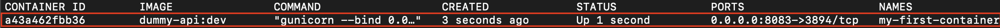

# Part 0: quick reminder of Docker

## Objectives

- be familiar with basic docker command
- understand containers, images and volumes

## A. The beginning

Before making the big jump in Kubernetes, let's have a quick look at how to create our workflow using Docker only. We'll create a simplify version of it just to get a basic understanding of how docker works.

### a. The dummy api

First, let's have a look at our dummy-api. To get an understanding of how it works, we'll dig into the main file :

```python
# code/dummy_api/api/main.py

from flask import Flask, jsonify
from redis import Redis
import os

app = Flask(__name__)
redis = Redis(
    host="redis-service",  # Which host to find the redis-server
    port=4321,  # Which port to find the redis-server
    decode_responses=True  # To avoid dealing with bytes instead of strings
)

@app.route("/")
def describe_redis():

    app_version = os.getenv("VERSION")

    try:
        first_name = redis.get("first-name")
        last_name = redis.get("last-name")
        environment = redis.get("environment")
    except:
        first_name = "ERROR"
        last_name = "ERROR"
        environment = "ERROR"
    
    return jsonify({
        "app-version": app_version,
        "first-name": first_name,
        "last-name": last_name,
        "environment": environment
    })
```

As explained in the introduction, this api reads values from a redis server. This server is hosted on "redis-service" and uses the port 4321. The dummy-api retrieves values from this server (the first-name, last-name and environment) and print it along with the "VERSION" environment variable. Simple enough !

Before creating a container that runs our code, we need to build an image of this container. An image is a snapshot of code and environnement. To create this snapshot, we use a Dockerfile that will describe how to create the snapshot. Here is our Dockerfile from our dummy-api :

```Dockerfile
# code/dummy_api/Dockerfile

FROM python:3.8

COPY ./requirements.txt /requirements.txt
RUN pip install -r requirements.txt

COPY . /app
WORKDIR /app

# Default app version. If not specified in the build, it will be version 1.0
ARG app_version=1.0
ENV VERSION=$app_version

# Expose port 3894 (important for the Kube example !)
CMD ["gunicorn", "--bind", "0.0.0.0:3894", "api.main:app"]
```

Let's build our docker image :

```bash
docker build . --build-arg app_version=DEV -t dummy-api:dev
```

To build our image, we specify some build args. Here the build arg is our app_version that we set to "DEV". We also tag our image with the value "dev" when doing "-t dummy-api:dev". The CMD part will be run when a container will be built using this image. Here we can see that it runs gunicorn, a WSGI (see reference below for more information), on port 3894.

After the build, if you check your docker images, you can find our dummy-api image :

```bash
docker image ls
```


Now that our image is created, we can run a container. If you know some object oriented programming, if we consider a docker image to be a class then a container would be an instance of this class.

Let's create a container of this dummy-api :

```bash
docker run -p 8083:3894 -d dummy-api:dev
```

The -p flag describes the port forwarding. It means that the port 3894 of the container will be accessible by the port 8083 of the machine on which it is run. The -d flag specify that we want to run the container in detach mode. If not specified, you would get the return logs of the gunicorn code and wouldn't get your terminal back after the container is up (you can try if you want).

We can see our newly built container :

```bash
docker ps
```



And by accessing http://localhost:8083, we can see our app.


The good news is that it worked ! The bad news is that it won't access our redis server because we still need to create it... Let's do that !

### b. The redis server

For the redis server, we'll use an pre-built image : the redis:alpine3.10. This means that we'll create a container based on a image already built on [Dockerhub](https://hub.docker.com/_/redis) (a repository for docker image).

To do this, we'll run the following command :

```bash
docker run --name redis-service -d redis:alpine3.10 redis-server --port 4321
```

Let's describe what's happening here : we ask docker to run a container named "redis-server" with the detached mode ("-d"). This container we'll be built using the "redis:alpine3.10" image. Once the container is up, it will run the "redis-server" command to start a redis server. For this command, the flag "--port 4321" is passed to change the default redis port (usually 6379).

We can see that both our container are up and running :

```bash
docker ps
```


Awesome ! Let's now refresh our webpage to check if our dummy-api is connecting to the redis server by refreshing our http://localhost:8083


Something is wrong ! Let's try to see what

## B. Figuring out what's wrong

### a. Docker network

To understand what was wrong, we need to take a greater look at what we are trying to accomplish in the "connect to redis" part of our python code :

```python
app = Flask(__name__)
redis = Redis(
    host="redis-service",  # Which host to find the redis-server
    port=4321,  # Which port to find the redis-server
    decode_responses=True  # To avoid dealing with bytes instead of strings
)
```

Here, we are trying to access our redis server using "redis-server" as host name. Basically, we are trying to access our redis container with its redis name instead of its IP address.

By default, containers run on the "bridge" network of Docker. By doing so, containers cannot access each other using their name. We could use IP address but this is clearly not a good solution : container can restart and have their IP address changed.

A far better solution would be to use docker networks !

To list the available networks, we can run the following command :

Let's have a look at our docker networks :

```bash
docker network ls
```


We can see the defautl "bridge" network. To have a look at which containers are using this network we can run the command :

```bash
docker network inspect bridge
```

The trick will now be to create a new network and run our 2 containers on it !

### b. Re deploy our use case with a network

To create our network, let's run the following command :

```bash
docker network create tutorial-network
```

This will create our brand new tutorial-network ! 

Let's now shutdown our 2 containers by running the following command :

```bash
docker stop <CONTAINER_ID>
```

We also need to remove our redis-server container to be able to create a new one with the same name :

```bash
docker rm redis-server
```

Now let's recreate everything on our tutorial-network :

```bash
docker run --name redis-service -d --network tutorial-network redis:alpine3.10 redis-server --port 4321
```

Then

```bash
docker run -p 8083:3894 -d --network tutorial-network dummy-api:dev
```

Now, by refreshing our webpage http://localhost:8083, we'll get :


This is the expected result : we don't have any value in our redis server so everything is null !

### c. Storing values in our redis server

To store value in the redis server, let's ssh into the redis container :

```bash
docker exec -it redis-service /bin/sh
```

Because we changed the default port of redis, we need to run the following command :

```bash
redis-cli -p 4321

127.0.0.1:4321> set first-name Defeated
OK
127.0.0.1:4321> set last-name Sanity
OK
127.0.0.1:4321> set environment Prod
OK
```

Let's now refresh our API :


## C. Next steps

You should now have a better understanding of Docker and of our general workflow. It's now time to build the same thing using Kubernetes !

Let's clean everything and move to the Kubernetes tutorial :

```bash
docker stop $(docker ps -a -q)
docker rm $(docker ps -a -q)
docker rmi $(docker images -a -q)
```
***[NEXT](Part1.md)***

## D. References

[Hackernoon tutorial](https://hackernoon.com/docker-tutorial-getting-started-with-python-redis-and-nginx-81a9d740d091)

[Docker ARG and ENV variables](https://vsupalov.com/docker-build-time-env-values/)

[Docker ARG vs ENV vs .env](https://vsupalov.com/docker-arg-env-variable-guide/)

[Redis persistence](https://redis.io/topics/persistence)

[Docker + Flask + Gunicorn + Nginx + Postgres](https://testdriven.io/blog/dockerizing-flask-with-postgres-gunicorn-and-nginx/)

[WSGI explanation with Gunicorn](https://coderbook.com/@marcus/use-gunicorn-to-serve-your-django-or-flask-wsgi-app/)

[Docker network](https://docs.docker.com/network/network-tutorial-standalone/)