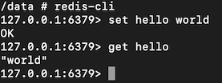

# Part 1 : cluster setup, redis server and redis feeder

## Objectives

- set up a testing context on our cluster
- get familiar with kubectl command
- understand Pods and Service
- deploy local containers on kubernetes

## A. Cluster setup

### a) Discovering the cluster

Docker desktop allows you to create a single node kubernetes cluster. To start your local Kubernetes cluster, please follow this [very quick guide](https://www.techrepublic.com/article/how-to-add-kubernetes-support-to-docker-desktop/). Once your cluster up and running, we can check its configuration using :

```bash
kubectl cluster-info
```

Which outputs :


Here, we can see the Kubernetes master single node and the KubeDNS (which we won't cover here).

### b) Namespace

To start our tutorial, we are going to create a namespace in our single node cluster. A namespace is an isolated space in the cluster. We can experiment in the namespace, and once done, we can delete it with all its resources, leaving our cluster clean. It's a very convenient way to manage interdependent resources.

To create a namespace, we are going use this configuration file :

```yml
# kubernetes_files/part1/0_namespace_tutorial.yml

apiVersion: v1
kind: Namespace
metadata:
  name: test
  labels:
    name: test
```

and run the following command :

```bash
kubectl apply -f kubernetes_files/part1/0_namespace_tutorial.yml
```

Let's see if everything worked as expected by running the following :

```bash
kubectl get namespace
```

This should outputs :


And we can see that our tutorial-namespace has been created !

### c) Context

To use our namespace automatically, we are going to create a context. In our scenario, creating a context is optional : we could pass an extra parameters to the kubeclt command to specify in which namespace we want to run it. For instance :

```bash
kubectl apply -f file.yml --namespace=tutorial-namespace
```

However, to avoid this extra argument on each kubectl command, we will create a context. A Kubernetes context represents a triplet : Cluster + User + Namespace. On docker desktop, we have one cluster (docker-desktop) and one user (docker-desktop). We are going to use them with our namespace to create our tutorial-context :

```bash
kubectl config set-context tutorial-context --namespace=tutorial-namespace --cluster=docker-desktop --user=docker-desktop
```

Let's see if our context is correctly created by running:

```bash
kubectl config view
```

Which outputs :


Last but not least, we'll switch our current context to the one we just created. Let's see what is our current context :

```bash
kubectl config current-context
```

On docker-desktop, this should outputs "docker-desktop". Let's change our context to the one we just created :

```bash
kubectl config use-context tutorial-context
```

Having done that, every time we'll run a kubectl command, it will apply it to our current-context, using our tutorial-namespace. Great ! Let's move on and start playing with our cluster !

## B. Starting a redis server

We'll now start with our redis server. For the sake of comprehension, we'll run most of our resources using the Pod configuration. This is not always the easiest way to build resources but it helps understanding how things work in Kubernetes : a Pod is the atomic element in a kubernetes cluster and it’s the simplest to understand. We'll move to more complicated concept later in our tutorial.

Our first pod will run a redis server. Here is what the configuration file looks like :

```yml
# kubernetes_files/part1/1_pod_redis.yml

apiVersion: v1  # Kubernetes api version
kind: Pod  # resource type (Pod, Service, Volume, ...)
metadata:
  name: redis-server
  labels:
    app: redis  # label to make the service work
spec:
  containers:
    - name: redis-server
      image: redis:alpine3.10
```

Let's explain a bit this configuration. This yaml file describe a Pod resource. A Pod is a resource available in Kubernetes apiVersion v1. Across this tutorial, you'll see different configuration files using different versions of Kubernetes api. To have a look at the api versions available on our cluster, we can run the following command :

```bash
kubectl api-versions
```

Later on, we'll see how we can add some new api on our cluster. But for now, let's focus on our Pod !

Kubernetes will use the description provided by this file to create our Pod. Kubernetes expects the resource to have a name, here it is “redis-server” (for those of you who read the [Part 0](Part0.md) of the tutorial, this is not a typo). Optionally, we can give it some labels.

Here, we chose to label our pod with an app label having the value "redis". Labels work like flags : by labelling resources with the same value we make sure that Kubernetes manages them coherently. This first label will be useful a little bit later, you'll see !

Finally, we have some information about the containers we would like to run in our Pod. Here we are running a single container instantiating a redis:alpine3.10 image.

Let's create this resource :

```bash
kubectl apply -f kubernetes_files/part1/1_pod_redis.yml
```

To see what happened, let's go on K9s:


As expected, we can see that our redis server is up and running. We can interact with our Pod by getting a shell inside it:

Using command line:

```bash
kubectl exec -it redis-server -- /bin/sh
```

Or directly in k9s by selecting the pod and pressing the "s" button (pure awesomeness !):


Once inside our Pod let's run some simple redis command:



Awesome ! Everything seems to work as expected ! Those of you who followed the [Part 0](Part0.md) might be a little bit confused (here by the port 6379 of our redis-cli). Please bare with me until I introduce the Service resource of Kubernetes.

Next step : use the redis_feeder code to populate the redis database.

## C. The redis feeder

Before describing our redis feeder Pod, we need to build an image of this code. Remember : we would like to work locally.

Let's go in the code/redis_feeder folder and run the following command :

```bash
docker build . -t redis_feeder
```

Let's try to run it to see if everything works fine :

```bash
docker run redis_feeder John Doe
```

Which outputs the following error :

```bash
Not possible to connect to redis-server:6379
```

This error is "normal": we are running our code in docker (so outside our kubernetes cluster) and there are no redis servers available for our redis_feeder. Let's have a quick look at what the code is trying to do :

```python
args = parser.parse_args()

first_name = args.first_name
last_name = args.last_name
environment = os.getenv("ENVIRONMENT", "dev")

redis = Redis(
    host="redis-service",  # Host to find the redis-server.
    port=4321,  # Port to find the redis-server
)

try:
    redis.set("first-name", first_name)
    redis.set("last-name", last_name)
    redis.set("environment", environment)
except ConnectionError:
    print("Not possible to connect to redis-server:6379")
    exit(1)

exit(0)
```

Our code is trying to connect to a redis server on the "redis-service" host using the port 4321. Once connected, it sets value for different variables (first-name, last-name and environment).

Hint : the host and port values are important ;-) !

Ok, let's try to deploy our redis feeder in our brand new kubernetes cluster ! Here is the Pod resource :

```yml
# kubernetes_files/part1/3_pod_feeder.yml

apiVersion: v1
kind: Pod
metadata:
  name: redis-feeder
spec:
  containers:
    - name: redis-feeder
      image: redis_feeder:latest
      imagePullPolicy: Never  # Use local image
      args: ["Cerebral", "Bore"]  # Random arguments
      env:
        - name: ENVIRONMENT
          value: "preproduction"  # Environment variable
  restartPolicy: OnFailure  # To avoid Kubernetes to keep the Pod retrying
```

This resource is a bit different from our redis server. We have :

- some arguments and an environment variable
- set the imagePullPolicy to "Never". This allows us to use local image. Otherwise, kubernetes will try to find the redis feeder on Dockerhub and will fail (I didn't put this code on Dockerhub).
- set the restartPolicy to "OnFailure". Kubernetes expect our Pods to be up and running. Otherwise, it tries to relaunch them. However our redis feeder is a task that dies once it has set some values in redis. We don't want to have Kubernetes retrying to launch this Pod.

Let's run the resource :

```bash
kubectl apply -f kubernetes_files/part1/3_pod_feeder.yml
```

and see what happens on K9s :


There is an error ! But what happened ? Let's figure out !

We can either press the "Enter" key on K9s to navigate to the logs or use the kubectl command :

```bash
kubectl logs redis-feeder
```

The output is clear :

```bash
Not possible to connect to redis-server:6379
```

The good news is that we ran our Pod in kubernetes ! Yay ! However we do not have our intended outcome... Why ?

Because the redis-feeder cannot reach the redis-server. The redis-server runs in a Pod with unpredictable host and port...

How are we going to tell to the redis-server Pod to expose it's port and fix a host ? By using a Service !

## C. Introducing kubernetes service

What is a service ? A service is a special resource that allows communication between Pods. Let's have a look at our service configuration :

```yml
# kubernetes_files/part1/2_service_redis.yml

apiVersion: v1
kind: Service
metadata:
  name: redis-service  # The host : same value in redis_feeder python code !
spec:
  ports:
  - port: 4321  # The port : same value in redis_feeder python code !
    targetPort: 6379 # The default redis port
  selector:
    app: redis  # Which pods are concerned
```

What happens here ? Kubernetes will create a resource that will allow **any Pods** with the "redis" label (our redis-server has it !) to be accessible with the "redis-service" host name. The service will also redirect the traffic on port 4321 to the port 6379 of any Pods with the "redis" label.

Let's create this service :

```bash
kubectl apply -f kubernetes_files/part1/2_service_redis.yml
```

Let's run again our redis_feeder Pod ! But before that, we need to delete the existing one (it terminated but still exists !). This is a little pain in the butt : each time you run a Pod, you need to delete it to run another "version" of it.

To delete the Pod :

```bash
kubectl delete pod redis-feeder
```

Then :

```bash
kubectl apply -f kubernetes_files/part1/3_pod_feeder.yml
```

This time if you connect back to our redis-server, we can see that the values are set accordingly to our pod_feeder.yml file :

```bash
kubectl exec -it redis-server -- /bin/sh
```

(or using k9s) :


Awesome ! We are now done for part 1 ! Let's move on to part 2 and try to consolidate our redis server !

***[NEXT](Part2.md)***

## C. References

[K9s quick demo](https://www.youtube.com/watch?time_continue=83&v=k7zseUhaXeU&feature=emb_logo)

