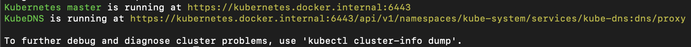

# Part 1 : cluster set up, redis server and redis feeder

## Objectives

- setting up a testing context on our cluster
- get familiar with kubectl command

## A. Cluster set up

### Discovering the cluster

Docker desktop allows you to create a single node kubernetes cluster. Once your cluster is up and running, we can check its configuration using :

```bash
kubectl cluster-info
```

Which outputs :



Here, we can see the Kubernetes master single node and the KubeDNS (which we won't cover here).

### Namespace

To start our tutorial, we are going to create a namespace in our single node cluster. A namespace is an isolated space in the cluster. We'll experiment in the namespace, and once done, we can delete it with all its ressources, leaving our cluster clean.

To create a namepsace, we are going to run the following command :

```bash
kubectl apply -f kubernetes_files/part1/0_namespace_tutorial.yml
```

```yml
# kubernetes_files/part1/0_namespace_tutorial.yml

apiVersion: v1
kind: Namespace
metadata:
  name: test
  labels:
    name: test
```

To check if everything is fine, we can run the following command :

```bash
kubectl get namespace
```

which outputs :


We can see our that our tutorial-namespace has been created.

### Context

To use our namespace automatically, we are going to create a context. This part could be skipped because we could pass an extra parameters to the kubeclt command to specify in which namespace we want to run it. For instance :

```bash
kubectl apply -f file.yml --namespace=tutorial-namespace
```

A Kubernetes context represents the triplet Cluster + User + Namespace. On docker desktop, we have one cluster (docker-desktop) and one user (docker-desktop). We are going to use them with our namespace to create our tutorial-context :

```bash
kubectl config set-context tutorial-context --namespace=tutorial-namespace --cluster=docker-desktop --user=docker-desktop
```

To see if our context is created, let's run the following command :

```bash
kubectl config view
```

Wich outputs :


We can see our tutorial-context

We now need to switch our current context to the one we just created. Let's see our current context :

```bash
kubectl config current-context
```

Which outputs "docker-desktop" in my case. Let's change our context with the following command :

```bash
kubectl config use-context tutorial-context
```

Now, everytime we'll run a kubectl command, it will apply it to our current-context, using our tutorial-namespace. Great ! Let's move on and start playing with our cluster.

## B. Starting a redis server

