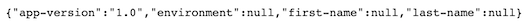

# Part 2 : deploy the dummy API and consolidate the redis server

## Objectives

- deploy an API on kubernetes
- understand Volumes and Volume Claims

## A. Deploy an API on kubernetes

### a) Building the image and deploying the Pod

Let's start by deploying our dummy api on our cluster. As in [Part1](Part1.md), we'll first build a local image of the api by heading in the code/dummy_api folder and run the following command :

```bash
docker build . --build-arg app_version=1.0 -t dummy-api:1.0
```

As always, let's test that everything works fine outside of the cluster :

```bash
docker run --name my-dummy-api -p 8082:3894 -d --rm dummy-api:1.0
```

To check that everything is fine, let's go to : http://localhost:8082/

You should get the following :


Again, this is "normal" locally because the redis server doesn't exists. If is working as expected, let's move on to our deployment on Kubernetes ! First, let's have a look at our deployment file :

```yml
# kubernetes_files/part2/4_pod_api.yml

apiVersion: v1
kind: Pod
metadata:
  name: dummy-api
  labels:
    app: api-label
spec:
  containers:
    - name: dummy-api
      image: dummy-api:1.0
      imagePullPolicy: Never
```

It looks very much like our redis-server Pod definition ! The only difference is the imagePullPolicy equals to "Never": we want to use the local build of our dummy-api.

Let's apply this resource to our cluster :

```bash
kubectl apply -f kubernetes_files/part2/4_pod_api.yml
```

and watch our dummy-api Pod through K9s :


Now, the next thing to do is to make our API accessible is to create a Service !

### b) Create the Service

Let's have a look at the service definition file :

```yml
# kubernetes_files/part2/5_service_dummy.yml

apiVersion: v1
kind: Service
metadata:
  name: dummy-service
spec:
  type: LoadBalancer  # To expose the service externally
  ports:
  - port: 8081  # The service port
    targetPort: 3894  # port expose by the api (check the dummy api Dockerfile)
  selector:
    app: api-label # same label as the dummy api Pod
```

This service is a bit different from the redis-service we built in [Part 1](Part1.md) : we can see the "LoadBalancer" type. This type makes a service accessible externally. By default, a service is only accessible inside a cluster (our redis-service for instance).

Let's build the service :

```bash
kubectl apply -f kubernetes_files/part2/5_service_dummy.yml
```

Let's look on k9s our services :


We can see that the dummy-service has an external ip on localhost. Let's connect to http://localhost:8081/ to see some magic happening :


Yay ! The same value that we pushed in the redis server database !

## B. Consolidate our redis server

Ok everything works smoothly. But imagine that our redis-server falls. If we turn it back on, all the data in it will be lost. Let's try the scenario.

Kill the Pod running the redis-server with the following command :

```bash
kubectl delete pod redis-server
```

May he rest in peace... And create a new Pod to replace him :

```bash
kubectl apply -f kubernetes_files/part1/1_pod_redis.yml
```

If we go back to http://localhost:8081/, everything is gone :



Wouldn't it be nice to save our redis data and to have them back when we replace our redis-server Pod ?

To do this, let's introduce Volumes and Volume Claims !

We'll start with the Volume Claim. A Volume Claim is a resource that allows Pods to do some operation on some existing volumes. With Volume Claims, Pods don't need to know what kind of Volumes they are using nor where those Volumes are.

Let's have a look at the resource :

```yml
# kubernetes_files/part2/6_persistent_volume_claim.yml

apiVersion: v1
kind: PersistentVolumeClaim
metadata:
  name: tutorial-storage-claim
spec:
  storageClassName: youhou
  accessModes:
    - ReadWriteOnce
  resources:
    requests:
      storage: 0.01M
```

Here we create a resource that will allow the Pods using it to read or write up to 0.01 Mega. The Pods only know about the Volume Claim. And, behind the scene, the Volume Claim will choose among available Volumes, the one with the right storageClassName.

Let's create the Volume Claim :

```bash
kubectl apply -f kubernetes_files/part2/6_persistent_volume_claim.yml
```

We know need to create a persistent Volume backing the Volume Claim. Here is the resource file :

```yml
# kubernetes_files/part2/7_persistent_volume.yml

apiVersion: v1
kind: PersistentVolume
metadata:
  name: tutorial-storage
spec:
  storageClassName: youhou
  capacity:
    storage: 0.1M
  accessModes:
    - ReadWriteOnce
  hostPath:
    path: "/tmp/kubernetes_infra_tutorial"  # our local directory
```

Pod using this Volume will write on our local machine in /tmp/kubernetes_infra_tutorial folder.

Let's create the persistent volume :

```bash
kubectl apply -f kubernetes_files/part2/7_persistent_volume.yml
```

Last but not least, we now have to make sure that our redis-server Pod is using the **Volume Claim** (not the Volume directly remember ?).

Here is a modified version of our redis-server Pod :

```yml
# kubernetes_files/part2/8_pod_redis_with_volume.yml

apiVersion: v1
kind: Pod
metadata:
  name: redis-server
  labels:
    app: redis # to make the service work
spec:
  containers:
    - name: redis-server
      image: redis:alpine3.10
      args: ["--appendonly", "yes"]

      volumeMounts:
        - mountPath: "/data"  # on the pod
          name: my-redis-storage

  volumes:
    - name: my-redis-storage
      persistentVolumeClaim:
        claimName: tutorial-storage-claim
```

To modify it, we need to delete it and recreate it :

```bash
kubectl delete pod redis-server
```

Then :

```bash
kubectl apply -f kubernetes_files/part2/8_pod_redis_with_volume.yml
```

## C. The final test

Now let's see if everything works fine. We'll start by deleting our old redis-feeder Pod...

```bash
kubectl delete pod redis-feeder
```

...and create it again :

```bash
kubectl apply -f kubernetes_files/part1/3_pod_feeder.yml
```

At this stage, the http://localhost:8081/ should return the following :


Great ! What happens if we delete our redis-server and recreate it ?

```bash
kubectl delete pod redis-server
```

```bash
kubectl apply -f kubernetes_files/part2/8_pod_redis_with_volume.yml
```

Result on http://localhost:8081 :


***[PREVIOUS](Part1.md)*** | ***[NEXT](Part3.md)***

## D. References

- [Python Flask on Kubernetes](https://kubernetes.io/blog/2019/07/23/get-started-with-kubernetes-using-python/)

- [Persistent volume tutorial](https://kubernetes.io/docs/tasks/configure-pod-container/configure-persistent-volume-storage/)
