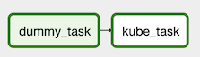
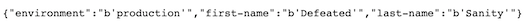

# Part 3: introducing the mighty Airflow

## Objectives

- run Airflow on Docker
- create a simple dag involving the [KubernetesPodOperator](https://airflow.readthedocs.io/en/latest/howto/operator/kubernetes.html)
- configure Airflow to orchestrate job on a Kubernetes cluster

## A. Setting up Airflow on Docker

Airflow is an incredible tool ! It helps you manage complex workflow. I won't present the tool too much. Michal Karzynski did an awesome job at presenting Airflow and explaining how it work on his [blog](http://michal.karzynski.pl/blog/2017/03/19/developing-workflows-with-apache-airflow/). It definitely worth reading if you're not yet familiar with Airflow. Thank you Michal !

For our tutorial, let's use an awesome Airflow image and customize it for our need. We'll use the [puckel image](https://github.com/puckel/docker-airflow). But we need to tweak it a little bit for our use. Remember ? We would like to user this Airflow image to trigger our redis feeder on our local Kubernetes cluster.

Let's go in code/airflow and build the following Dockerfile :

```Dockerfile
FROM puckel/docker-airflow

USER root
RUN pip install apache-airflow[kubernetes] # to install the extensions that we need

USER airflow
```

It's almost the same as the original one, we just added an install of the kubernetes extensions.

Let's build it :

```bash
# Run the command in the code/airflow folder

docker build . -t my-airflow
```

Now, we'll run it but we need 2 things to make it work :

- mount our dags folder as a volume to be able to play around with the cluster and avoid building our Airflow image each time we change something

- mount our kubernetes cluster configuration

```bash
# Run the command in the code/airflow folder

docker run -d -p 8080:8080 -v $(pwd)/dags:/usr/local/airflow/dags -v ${HOME}/.kube/config:/home/airflow/docker_desktop_config my-airflow webserver
```

A quick word on the run command:

- By default, airflow expects the dags to be stored in the following folder : */usr/local/airflow/dags*. So that's where we store it !

- By default, the local kubernetes configuration file is located in ${HOME}/.kube/config. If it's not there, you can run the following command to find it :

```bash
kubectl config --help
```

Which outputs :


- I choose to store my local kubernetes config file in the following folder (on the docker container): */home/airflow/docker_desktop_config my-airflow webserver*

If everything worked as expected, please behold the mighty Airflow: http://localhost:8080/


## B. Play around with Airflow

As you can see on the homepage, a kube_dag has been created. This dag is in the dags folder in the code/airflow/dags.

Let's have a look at it :

```python

kube_operator = KubernetesPodOperator(
    task_id='kube_task', 
    config_file='/home/airflow/docker_desktop_config', # where we stored our kubernetes config file
    cluster_context="tutorial-context", # our context
    in_cluster=False,


    namespace='tutorial-namespace', # our namespace
    image="redis_feeder:latest", # our local image
    name="redis-feeder-airflow", # our pod name
    image_pull_policy='Never', # to use local image
    arguments=["Defeated", "Sanity"], # some really cool arguments !

    env_vars={
        'ENVIRONMENT': 'production'
    },

    is_delete_operator_pod=True, # to delete the operator once done
    get_logs=True,
    dag=dag
)
```

We can see a lot's of the option that we already know from our Pod configuration. There are some extra options though :

- we can specify a kubernetes configuration which could allow multiple kubernetes cluster orchestration

- we can also ask Airflow to delete the Pod once ran to avoid having a dead Pod lying in our cluster (you wouldn't want that right ?)

Ok let's run the dag ! As Michal said :

- first turn the workflow on
- then click the Trigger Dag
- and finally, click on Graph View !


This is what you should get :


Now if you refresh our API http://localhost:8081/ you should see the values of our dag !




## C. References

- [A great Airflow tutorial !](http://michal.karzynski.pl/blog/2017/03/19/developing-workflows-with-apache-airflow/)

- [Comprehensive guide of the Airflow puckel image](https://medium.com/@itunpredictable/apache-airflow-on-docker-for-complete-beginners-cf76cf7b2c9a)

- [Customize your Airflow puckel image](https://github.com/puckel/docker-airflow/issues/261)

- [A very complete KubernetesPodOperator example](https://varlogdiego.com/airflow-kubernetes-operator)

- [The KubernetesPodOperator technical doc](https://airflow.apache.org/docs/stable/_api/airflow/contrib/operators/kubernetes_pod_operator/index.html)
