# Part 4 : going a further

## Objectives

- understanding deployments
- understanding the concept of canary deployments
- understanding ingress resources
- understanding horizontal autoscaling

## A. Deployments

Until now, we only managed Pod : this was our order of magnitude. However, Kubernetes allows us to manage group of Pods.

Let's say that we would like to deploy 3 containers with our dummy-api. By doing so, we can share the incoming traffic on 3 different Pods. We can achieve this with one resource: the deployment !

```yml
# kubernetes_files/part4/9_deployment_stable.yml

apiVersion: apps/v1
kind: Deployment
metadata:
  name: dummy-api-stable
spec:
  replicas: 3  # Number of Pods to be created
  selector:
    matchLabels:
      dummy-version: "1.0"  # What label is our Deployment looking for
  template:
    metadata:
      labels:
        app: api-label  # First label of the Pod (the one used for the service)
        dummy-version: "1.0"  # Second label of the Pod (the one used by the deployment)
    spec:
      containers:
      - name: dummy-api
        image: dummy-api:1.0
        imagePullPolicy: Never
        resources:  
          requests:  #  For the horizontal pod autoscaling to work
            cpu: 4m  # Each pods will have 25 m cpu to their disposal
          limits:
            cpu: 5m
```

There are 3 parts in this deployment resource :

- the replicas: this is the number of Pod that we would like to have up and running with this deployment
- the selector: wich Pods will be involved by the deployment
- the template: how each Pods in the deployment should be built

As you can see, the template looks very much like any Pod ressource. We built earlier. Here, we just added some extra notions about the Pods resources:

- requests: in this part, we specify how much cpu each Pod will get. It's important to understand that the Pod will get this amount of cpu even if it uses less.
- limits: in this part, we specify the maximum cpu usage of each Pod. If it goes above, the cpu will be restricted to the limit.

This will be usefull a bit later when we'll dig into horizontal auto scaling.

Let's run this resource and have a look at our cluster :

```bash
kubectl apply -f kubernetes_files/part4/9_deployment_stable.yml
```

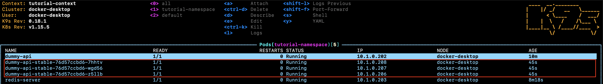

As we can see, we have 3 dummy-api-stable Pods. On k9s, by typing :

```bash
:deploy
```

We can access the deployment dashboards showing our dummy-api-stable deployment :

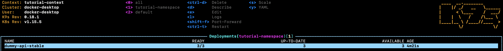

As you'll realize, k9s is really a great tool to monitor our Kubernetes cluster. We now know how to deploy a whole deployment of several Pods and that's a great time to introduce the concept of canary deployment !

## B. Canary deployment

Let's say that we just added a cool new feature to our dummy-api and that we would like to put it in production. Our production cluster features 4 Pods of the old and very used release. In order to make things smooth and avoid a one shot full deployment on all of our Pods, we would like to have a small portion of our traffic (let's say 25%) going in the new release and the rest (75%) to the current release. This is what is called a canary deployment !

So let's do this. First things first, we'll build a new version of our dummy-api with an upgraded version :

```bash
docker build . --build-arg app_version=2.0 -t dummy-api:2.0
```

Now let's delete our first and lonely dummy-api Pod (the one we've created in part 1) :

```bash
kubectl delete pod dummy-api
```

That leaves us with 3 dummy-api-stable Pods. Now let's make a deployment with our new api version (this is the canary deployment ;-)) :

```yml
# kubernetes_files/part4/10_deployment_canary.yml

apiVersion: apps/v1
kind: Deployment
metadata:
  name: dummy-api-canary  # DIFFERENCE
spec:
  replicas: 1  # DIFFERENCE
  selector:
    matchLabels:
      dummy-version: "2.0"  # DIFFERENCE
  template:
    metadata:
      labels:
        app: api-label  # First label of the Pod (the one used for the service)
        dummy-version: "2.0"  # DIFFERENCE
    spec:
      containers:
      - name: dummy-api
        image: dummy-api:2.0 # DIFFERENCE
        imagePullPolicy: Never
        resources:  
          requests:  #  For the horizontal pod autoscaling to work
            cpu: 4m  # Each pods will have 25 m cpu to their disposal
          limits:
            cpu: 5m
```

As you can see, the canary deployment resources looks almost like the stable deployment one. The only difference lies in :

- the number of replicas (1 instead of 3 to make a 25%/75% deployment)
- the image version (dummy-api:2.0 instead of dummy-api:1.0)
- the "dummy-version" label dummy-version with a value of 2.0 instead of 1.0 (we'll see why in a moment)

We can see however that both deployment have the same "app" label with the value "api-label". This will make both deployment resources use the same service (the dummy-service that we've created in [part 2](Part2.md)) !

Let's deploy our canary and make a curl loop to see what happens !

```bash
kubectl apply -f kubernetes_files/part4/10_deployment_canary.yml
```

We can see our 4 Pods with 1 canary and 3 stables (25% / 75% deployment):

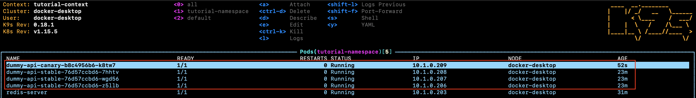

Now let's run the following command and check the outputs:

```bash
for i in `seq 1 10`; do curl http://127.0.0.1:8081; done
```

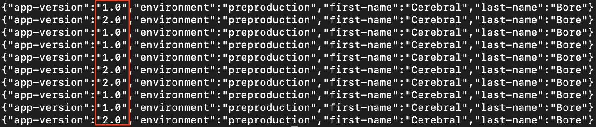

Fantastic ! We have 75% of our traffic going to dummy-api v1.0 and 25% going to dummy-api 2.0 and let's face it: it's really awesome ! But what if we would like to test our dummy-api 2.0 only ? It would be frustrating to change apps during a testing period. Wouldn't it be also great to have a dedicated route targeting only our canary api ? Let's do that with an ingress rules !

## C. Ingress rules

So here is the master plan: we'll build 2 different http route that will target 2 different versions of our dummy-api. To do this we'll need :

- a stable service : to access the stable version of our dummy-api
- a canary service : to access the canary version of our dummy-api
- an ingress controller (resource to install on our cluster)
- an ingress : to control trafic rules

### a. Building the services

Let's start with our services (nothing really fancy here):

```yml
# kubernetes_files/part4/11_service_stable.yml

kind: Service
apiVersion: v1
metadata:
  name: dummy-stable-service
spec:
  type: ClusterIP
  ports:
  - port: 8081  # From inside the cluster, what port does the service expose?
    targetPort: 3894  # Which port do pods selected by this service expose?
  selector:
    app: api-label  # To select the containers
    dummy-version: "1.0"  # To select the containers
```

```bash
kubectl apply -f kubernetes_files/part4/11_service_stable.yml
```

```yml
# kubernetes_files/part4/12_service_canary.yml

kind: Service
apiVersion: v1
metadata:
  name: dummy-canary-service
spec:
  type: ClusterIP
  ports:
  - port: 8081  # From inside the cluster, what port does the service expose?
    targetPort: 3894  # Which port do pods selected by this service expose?
  selector:
    app: api-label  # To select the containers
    dummy-version: "2.0"  # To select the containers
```

```bash
kubectl apply -f kubernetes_files/part4/12_service_canary.yml
```

### b. Installing the ingress controller

Let's continue with the ingress controller. There are several option available but for this demo, we'll use the nginx-ingress-controller. To do this easily, we'll use helm (tool to streamlines kubernetes applications). See [here](https://helm.sh/docs/intro/install/) for installation.

Let's add the stable helm chart repo to our helm tool :

```bash
helm repo add stable https://kubernetes-charts.storage.googleapis.com
```

And finally, let's deploy our nginx ingress controller:

```bash
helm install tutorial-ingress-controller stable/nginx-ingress
```

In k9s, we can see 2 new Pods :

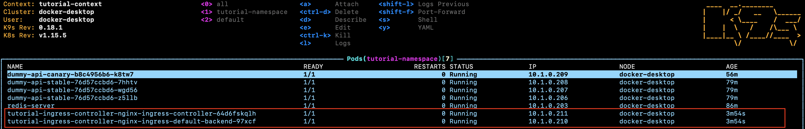

And 2 new Services :

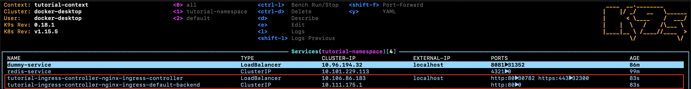

If, for any reason, you would like to delete our ingress controller, you can run the following command :

```bash
helm delete tutorial-ingress-controller
```

### c. Implementing the ingress rules

Now that we have our ingress controller installed, we can make an ingress resource. An ingress resource sits between the incoming trafic and your different services. Based on routes, it will redirect trafic on our stable service or our canary service. Let's have a look at the yml file to get a better understanding of how it works :

```yml
# kubernetes_files/part4/13_ingress.yml

apiVersion: extensions/v1beta1
kind: Ingress
metadata:
  annotations:
    kubernetes.io/ingress.class: nginx  # INFORMATION ONLY PURPOSES : we can delete annotations it doesn't matter
  name: app-ingress
spec:
  rules:
  - host: canary.tutorial-api.com  # The canary route
    http:
      paths:
      - backend:
          serviceName: dummy-canary-service
          servicePort: 8081
  - host: tutorial-api.com  # The stable release route
    http:
      paths:
      - backend:
          serviceName: dummy-stable-service
          servicePort: 8081
```

Here, we have the following happening :

- all the traffic that goes on http://canary.tutorial-api.com will hit our dummy-canary-service on port 8081 and will ultimately hit our canary dummy-api pod
- and, following the same idea, the traffic that goes on http://tutorial-api.com will hit our stable dummy-api pod

Let's run this resource :

```bash
kubectl apply -f kubernetes_files/part4/13_ingress.yml
```

Before testing, we need to edit our /etc/hosts file by adding the following lines :

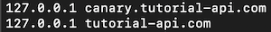

We can now go on our newly created urls to hit the canary deployment or the stable deployment !

## D. Autoscaling

Last but not least, let's try to autoscale our dummy-api !

### a. Installing a metric server

Usually, in production, we would run the following command against our kubernetes cluster :

```bash
kubectl apply -f https://github.com/kubernetes-sigs/metrics-server/releases/download/v0.3.6/components.yaml
```

However and for some reason I cannot really explain, the standard configuration won't work in our local cluster : the metric server will get installed but it won't display any metrics for our pods...

According to a stackoverflow post that I've linked in the reference below (thank you very much for the tips !), here is what we'll do.

First let's clone the repository for the metric server :

```bash
git clone git@github.com:kubernetes-sigs/metrics-server.git
```

We'll then edit the file deploy/kubernetes/metrics-server-deployment.yaml by adding the following lines :

```yaml
containers:
- name: metrics-server
    image: k8s.gcr.io/metrics-server-amd64:v0.3.6
    command:                    # line added !
      - /metrics-server         # line added !
      - --kubelet-insecure-tls  # line added !
```

Then at the root folder of your cloned project, run the following command :

```bash
kubectl apply -f deploy/kubernetes
```

This should install your metric server properly ! Let's check that :

```bash
kubectl cluster-info
```

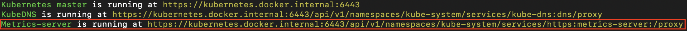

### b. Create a horizontal pod autoscaler

Now that the metric server is install, we can create an horizontal pod autoscaler. Let's have a look at the yml file :

```yml
# kubernetes_files/part4/13_ingress.yml

apiVersion: autoscaling/v2beta1
kind: HorizontalPodAutoscaler
metadata:
  name: dummy-api-stable-autoscaler
spec:
  scaleTargetRef:
    apiVersion: apps/v1
    kind: Deployment
    name: dummy-api-stable  # deployment name
  minReplicas: 1  # Minimum number of pods (in case of low activity)
  maxReplicas: 10  # Maximum number of pods (in case of high activity)
  metrics:
  - type: Resource
    resource:
      name: cpu
      targetAverageUtilization: 80  # if the pods of the deployment are using 80% of their requested cpus, scale !
```

There are 3 pieces of key information here. The first two are the minReplicas and maxReplicas. This define our scaling strategy depending on the activity. Basically, we'll not scale below 1 Pod in case of low traffic and we won't get above 10 Pods in case of high traffic.
The last piece of information is the targetAverageUtilization. This part can be a bit tricky to understand so let's give an explanation. Here, the value is expressed in percentage (to have it in absolute value, you can use targetAverageValue). It means that if the current pods are, on average, using 80% of their ressources, we need to add some. How many of them do we need to add ?
To calculate this, we can have a look at the algorithm details supplied [here](https://kubernetes.io/docs/tasks/run-application/horizontal-pod-autoscale/) :

```b
desiredReplicas = ceil[currentReplicas * ( currentMetricValue / desiredMetricValue )]
```

Let's take an example. We have 3 Pods in our Deployment. Let's assume that they use 25% of their ressources. Suddenly, we have a boost in our traffic that makes our Pods use 160% of their ressources on average. We need to scale up ! How much Pods do we need in total to deal with this peak of activity ?

```b
ceil[3 * (160 / 80)] = 6 Pods
```

As we have already 3 Pods up and running, the horizontal pod autoscaler will add an extra 3 to deal wit this situation.

How do we know what are the resources used by our Pods ? We specified it in our deployment ! Remember ?

```yml
    spec:
      containers:
      - name: dummy-api
        image: dummy-api:1.0
        imagePullPolicy: Never
        resources:  
          requests:  #  For the horizontal pod autoscaling to work
            cpu: 4m  # Each pods will have 25 m cpu at their disposal
          limits:
            cpu: 5m  # Each pods won't have more than 5 m cpu at their disposal
```

In our container, each Pod have 4m cpu at their disposal. Let's have a look at their usage :

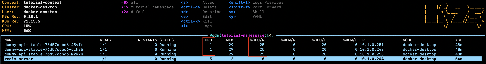

In my case, we can see that they use only 1m of cpu so they are at 25% of their requested capacity (%CPU/R). By the way, if you don't see the %CPU/R in your version of k9s, it's probably because the installation of the metrics server didn't work. Please have a look at the section above to see why.

Let's create our horizontal pod autoscaler resource :

```bash
kubectl apply -f kubernetes_files/part4/14_horizontal_pod_autoscaler.yml
```

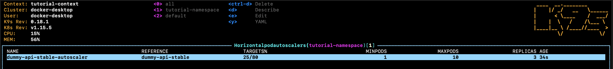

Now let's simulate a boost of traffic. In your terminal, past the following command :

```bash
while true; do curl -s http://localhost:8081 > /dev/null; done
```

Every 30 seconds, the autoscaler will check the average resource usage of our deployment and adjust the number of Pods in consequence. After the traffic boost, here is how it looks like on my cluster :

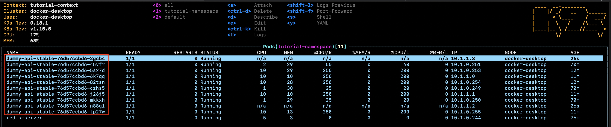

## C. Conclusion / Next steps

That's it for this tutorial. Hopefully, you found it usefull and get a better understanding on how Kubernetes work. As you can see, the configuration files can be a bit verbose and it's not always convenient to use them like that in a professionnal environment. A better way to do that is to consider helm and helm chart. Those tools allow you to package your configuration and to make them flexible. Doing so, you could run a single command and get the dummy-api, the service and the autoscaler up and running. You could also have different values for your different environnements (dev, staging, production). I will try to add a part on this.

Also, this tutorial is a bit light on Airflow. I'll definetly add some materials on this wonderful tool.

Remember to clean your cluster ! If you're using docker desktop, you can restart your kubernetes cluster. You could also run the following command (namespace are awesome !) :

```bash
kubectl delete namespace tutorial-namespace
```

Thank you very much for reading. Any feedbacks will be very welcome !

## D. References

- [Canary deployments](https://medium.com/google-cloud/kubernetes-canary-deployments-for-mere-mortals-13728ce032fe)

- [Port vs TargetPort vs NodePort](https://matthewpalmer.net/kubernetes-app-developer/articles/kubernetes-ports-targetport-nodeport-service.html)

- [Helm repo update error](https://www.jforte.me/2020/01/getting-started-with-helm-v3/)

- [Helm tutorial](https://docs.bitnami.com/tutorials/create-your-first-helm-chart/)

- [Helm 3 Install](https://computingforgeeks.com/install-and-use-helm-3-on-kubernetes-cluster/)

- [Horizontal pod autoscaling](https://cloud.google.com/kubernetes-engine/docs/how-to/horizontal-pod-autoscaling)

- [Metrics server issue](https://stackoverflow.com/questions/54106725/docker-kubernetes-mac-autoscaler-unable-to-find-metrics)

- [Understanding metrics](https://sysdig.com/blog/kubernetes-limits-requests/)

- [Simulating load](https://codeburst.io/practical-guide-to-kubernetes-scaling-1-pods-5a7ed08f4e8b)

- [Understanding ingress](https://medium.com/google-cloud/kubernetes-nodeport-vs-loadbalancer-vs-ingress-when-should-i-use-what-922f010849e0)