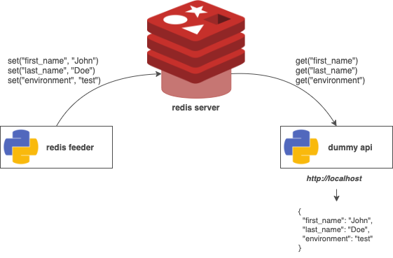
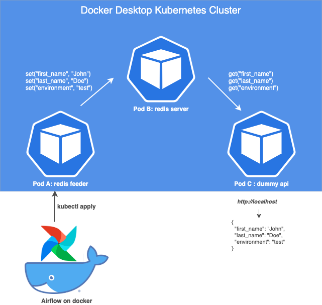

# Kubernetes hands on tutorial

## Introduction

In this tutorial we are going to build a very simple workflow on Kubernetes and "automate" it using Airflow. This workflow consists of :

- a **redis feeder** task, taking 2 arguments (first_name and last_name) and one environment variable (ENVIRONMENT) and pushing those values to a redis server

- a **redis server**, storing the first name, last name and environment pushed by the feeder

- a **dummy api**, reading the first name, last name and environment on the redis server and displaying it with Flask

We will slowly build this simple workflow on a local Kubernetes cluster. Once done, we'll use an external instance of Airflow running on a docker container **out of the kubernetes cluster** to trigger our redis feeder.

If everything goes smoothly and works as I expect, we should get the following infrastructure :

## Prerequisite

For this tutorial, I'll assume that you have :

- a local kubernetes cluster (docker desktop, minikube, ...). See [here](https://medium.com/containers-101/local-kubernetes-for-mac-minikube-vs-docker-desktop-f2789b3cad3a),

- a local version of my code,

- a fairly good understanding of Docker (images, containers, volumes, ports...), but do not fear, the Part0 of this tutorial will give you a quick refresher of Docker applied to our usecase

- K9s as a nice to have (some of my screenshots will display this awesome tool).See [here](https://github.com/derailed/k9s).

To build this tutorial I used Docker Desktop 2.2.0.4. for Mac OS with its built in Kubernetes cluster.

## Table of content

The tutorial is organized in the following way :

### [Part 0: quick refresher on how to use Docker](Part0.md)

### [Part 1: cluster setup, redis server and redis feeder](Part1.md)

### [Part 2: deploy the dummy API and consolidate the redis server](Part2.md)

### [Part 3: introducing Airflow](Part3.md)

### [Part 4: going further](Part4.md)

In each part, I put some references if you want to dig further in the presented concepts. Now if you’re ready, let's roll up our sleeves and make this workflow happen !
