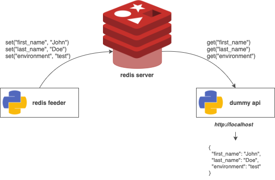
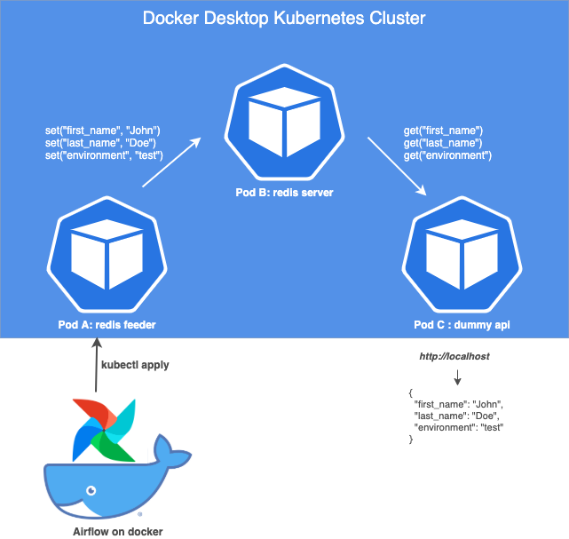

# Kubernetes tutorial for beginners

## Introduction

In this tutorial we are going to build this very simple workflow :

As you can see, we have 3 different pieces of software :

- **redis feeder** : a console task taking 2 arguments (first_name and last_name) and one environment variable (ENVIRONMENT) and pushing those value to a redis server

- **redis server** : a redis server storing the first name, last name and environment pushed by the feeder

- **dummy api** : a simple API that will read the first name, last name and environment on the redis server and display it with Flask

We will slowly build those 3 building blocks using a local version of Kubernetes. We'll then use an external version of Airflow running on a docker container **out of the kubernetes cluster** to trigger the redis feeder.

This is our expected result :

## Prerequisite

For this tutorial, I'll assume that you have :

- a local kubernetes cluster (docker desktop, minikube, ...)

- K9s as a nice to have (some of my screenshots will display this tool)

To build this tutorial, I run the test on Docker Desktop 2.2.0.4. for Mac OS.

## Table of content

### Part 1 : cluster set up, redis server and redis feeder

### Part 2 : consolidate redis server with data persistence on a volume

### Part 3 : deploy the dummy api

### Part 4 : introducing the mighty Airflow

### Part 5 : going a bit further

# References
https://medium.com/@itunpredictable/apache-airflow-on-docker-for-complete-beginners-cf76cf7b2c9a
http://michal.karzynski.pl/blog/2017/03/19/developing-workflows-with-apache-airflow/
https://github.com/puckel/docker-airflow/issues/261
https://varlogdiego.com/airflow-kubernetes-operator

https://airflow.apache.org/docs/stable/_api/airflow/contrib/operators/kubernetes_pod_operator/index.html

# Flask on Kube
https://kubernetes.io/blog/2019/07/23/get-started-with-kubernetes-using-python/